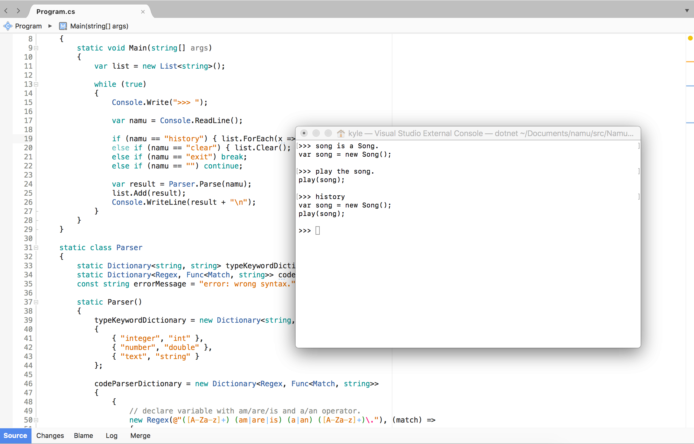

# namu
**namu** is a programming language that makes it possible to write code **in English sentences** without knowledge of programming. 



# How it works
name codes are converted to C# codes.

Here is a sample Hello world.
``` namu
// namu code
Console, Write Line "Hello world!".

// after converting
Console.WriteLine("Hello, World!");
```

And converted codes are run on C# Interactive(roslyn).

So you can write and run english sentences without compile.

# Goal
The primary goal is to make namu a .NET language (without converting to C#), and the ultimate goal is to make namu available in other languages(JVM, python, etc.).

## Example
``` 
// on JVM
System's out, println "Hello, world!".

// python
print "Hello, world!".

// javascript
console, log "Hello, world!".
```

# Progress
|Features|Progress|
|--------|--------|
|Language Specification|In progress|
|Supporting basic C# syntax|In progress|
|namu Interactive|Not started|
|namu basic library|Not started|
|namu compiler|Not stared|